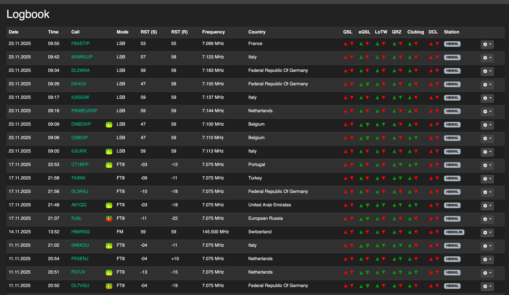

# Coolify Template for Wavelog (Ham Radio Logbook)


A Docker Compose template for running [Wavelog](https://www.wavelog.org/) - a self-hosted web logbook for ham radio operators - on [Coolify](https://coolify.io/).

Wavelog started as a fork of Cloudlog and has grown into its own actively developed project. Log your contacts (QSOs) from a browser, get callsign lookups, DXCC and other award tracking, contest support, QSL card printing, and sync with LoTW, eQSL, QRZ.com, HRDLOG.net and Club Log.

The stack pairs the official `ghcr.io/wavelog/wavelog` image with MariaDB 11.8. Both services have health checks, so Coolify's proxy won't route traffic until the app is actually ready. Database credentials and the domain are generated automatically through Coolify's magic environment variables - nothing to hardcode.

## Usage

1. In Coolify, create a new resource and pick the **Docker Compose Empty** build pack.
2. Paste the contents of `wavelog.yaml` into the compose editor.
3. Deploy. Coolify will pull both images, create the volumes, and start MariaDB first, waiting for it to report healthy before starting Wavelog.
4. Open the generated domain and go through Wavelog's install wizard. You'll need four values:
   - **Database hostname:** `wavelog-db`
   - **Database name:** `wavelog`
   - **Database username / password:** the auto-generated `SERVICE_USER_WAVELOGDB` / `SERVICE_PASSWORD_WAVELOGDB` values, visible in the resource's environment variables tab in Coolify

The `# documentation`, `# slogan`, `# category`, `# tags`, `# logo` and `# port` comment lines at the top of `wavelog.yaml` are Coolify's metadata format for official one-click services. They're harmless if you just paste the file manually - Coolify ignores them outside of the template catalog - but they're kept here since this template started as a submission for Coolify's official service list and may still be merged there later.

## Screenshot



## Changing the domain later

Wavelog writes its URL into `config.php` once, during the install wizard, and doesn't pick up domain changes automatically. If you change the domain in Coolify afterward, Wavelog will keep redirecting to the old one. Fix it by updating `base_url` inside the `wavelog-config` volume:

```bash
sed -i "s#https://old-domain.tld/#https://new-domain.tld/#g" /var/www/html/application/config/docker/config.php
```

No container restart needed - Wavelog picks up the change immediately.

## Links

- [Wavelog website](https://www.wavelog.org/)
- [Wavelog GitHub](https://github.com/wavelog/wavelog)
- [Wavelog documentation](https://docs.wavelog.org/)
- [Coolify](https://coolify.io/)

## Third-party assets

The Wavelog logo (`images/wavelog-logo.svg`) and the logbook screenshot (`images/wavelog-logbook.webp`) belong to the Wavelog project and are used here only to identify and illustrate the software - they aren't covered by this repository's license. Wavelog itself is licensed under its own terms - see the [Wavelog repository](https://github.com/wavelog/wavelog) for details.

## License

[MIT](LICENSE) - applies to `wavelog.yaml` and this README. Provided as-is, with no warranty.
